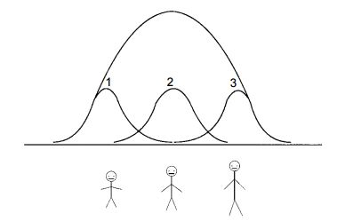

```{r message=FALSE, echo=FALSE}
require(mosaic)
options(digits=3)
trellis.par.set(theme=theme.mosaic())
```
# Introduction

- SRT 5.5
- Sampling is an essential component of environmental studies
- Can be very expensive and time-consuming -> need to provide as much information as possible
- Occupational hazards -> importance of the sampling scheme

# Rule of Thumb


Always consider alternatives to simple random sampling for a potential increase in $\textbf {efficiency, lower costs, and validity}$. 


# Composite sampling
- The number of required analyses is reduced by compositing several samples into one and analyzing the composited sample


# E.g. Contaminated hot spots

- Pooling samples of 5 provides substantial savings for prevalences from 0.005 to 0.05

$$ Relative cost =  \frac{n+1}{n}-(1-\pi)^n$$

- relative cost: relative cost to no compositing
- n: no. of samples in the pooled sample
- $\pi$: prevalence of contaminated samples
- e.g. if $\pi$=0.10, when n=1, RC=1.1; when n=5, RC=0.61; when n=30, RC=0.99 -> pools of five is better  


# Ranked Set Sampling
- Use professional judgement $\textbf{ranking}$ of a characteristic of interest to improve estimation of a population parameter


# E.g. Mean Age of trees
- Appropriate judgment-based measurement (e.g. visual size of the tree, bigger the tree older the age)

1. Randomly select 3 trees, mark the smallest tree
2. Randomly select another set of 3 trees, mark the medium one
3. Randomly select another set of 3 trees, mark the biggest one
4. Repeat 1-3 ten times, 10 trees from each stratum, a total of 90 trees
5. Determine the age of each marked tree and use it to estimate


# Assessment 

How are you going to estimate the mean height of students at Amherst College using Ranked Set Sampling?


# Answer


\tiny{Patil, G. P. 2002. “Ranked Set Sampling, Volume 3, Pp 1684–1690 in Encyclopedia of Environmetrics” edited by A. H. El-Shaarawi and W. W. Piegorsch. Retrieved July 2015 (http://sites.stat.psu.edu/~gpp/pdfs/tr2001-0203.pdf).}


